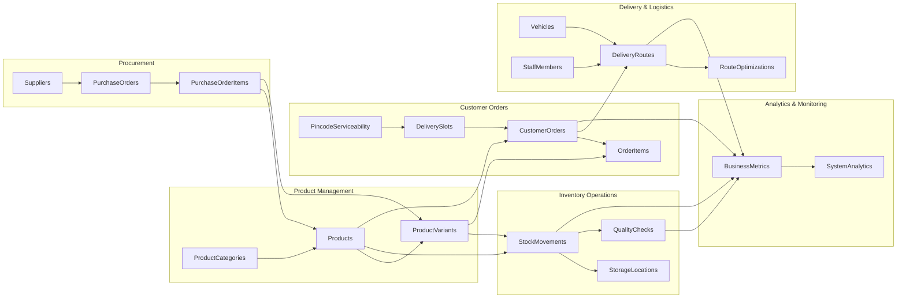

# 🚀 Aurora Spark Theme - Complete Product Flow Diagram

## 📋 Overview
This document illustrates the complete end-to-end flow from product addition in inventory to customer delivery in the Aurora Spark Theme multi-portal SaaS system.

---

## 🔄 Complete Product Flow

```mermaid
graph TD
    %% Product Setup Phase
    A[🛡️ Super Admin<br/>Creates Product Category] --> B[🏭 Warehouse Manager<br/>Adds New Product]
    B --> C[🏭 Warehouse Manager<br/>Creates Product Variants<br/>Size/Color/Weight]
    C --> D[🏪 Supplier Manager<br/>Links Product to Supplier]
    
    %% Procurement Phase
    D --> E[🏪 Supplier Manager<br/>Creates Purchase Order]
    E --> F[🏪 Supplier<br/>Confirms Order & Ships]
    F --> G[📦 Inventory Staff<br/>Receives Stock<br/>+ Quality Check]
    
    %% Quality & Storage Phase
    G --> H{🔍 Quality Check<br/>Passed?}
    H -->|✅ Pass| I[📦 Inventory Staff<br/>Updates Stock Levels<br/>Assigns Storage Location]
    H -->|❌ Fail| J[📦 Inventory Staff<br/>Records Waste<br/>Rejects Stock]
    J --> K[🏪 Supplier Manager<br/>Handles Rejection<br/>New Order]
    K --> E
    
    %% Customer Order Phase
    I --> L[🛒 Customer<br/>Browses Products<br/>Selects Variants]
    L --> M[🛒 Customer<br/>Adds to Cart<br/>Selects Delivery Slot]
    M --> N[🛒 Customer<br/>Places Order<br/>Chooses Payment Method]
    
    %% Order Processing Phase
    N --> O[📦 Inventory Staff<br/>Receives Order<br/>Picks Items by Variant]
    O --> P{📦 Stock Available<br/>for Variants?}
    P -->|❌ No| Q[📦 Inventory Staff<br/>Updates Stock Status<br/>Notifies Customer]
    P -->|✅ Yes| R[📦 Inventory Staff<br/>Picks & Packs Order<br/>Quality Check]
    
    %% Logistics Phase
    R --> S[🚛 Logistics Manager<br/>Assigns to Route<br/>Optimizes Delivery]
    S --> T[🚛 Logistics Manager<br/>Assigns Vehicle & Driver<br/>Based on Pincode Slots]
    T --> U[🚚 Delivery Personnel<br/>Loads Vehicle<br/>Starts Route]
    
    %% Delivery Phase
    U --> V[🚚 Delivery Personnel<br/>Navigates to Customer<br/>Follows Route Sequence]
    V --> W[🚚 Delivery Personnel<br/>Delivers Order<br/>Collects Payment if COD]
    W --> X[🚚 Delivery Personnel<br/>Gets Customer Signature<br/>Takes Photo Proof]
    X --> Y[🚚 Delivery Personnel<br/>Updates Order Status<br/>Completes Delivery]
    
    %% Settlement Phase
    Y --> Z[🚛 Logistics Manager<br/>Reviews Delivery Performance<br/>Route Analytics]
    Z --> AA[🏭 Warehouse Manager<br/>Updates Inventory<br/>Analyzes Stock Turnover]
    AA --> BB[🏪 Supplier Manager<br/>Processes Payment<br/>Supplier Performance Review]
    BB --> CC[🛡️ Super Admin<br/>Reviews System Analytics<br/>Business Intelligence]
    
    %% Feedback Loop
    CC --> DD[📊 System Updates<br/>Inventory Levels<br/>Reorder Points]
    DD --> EE{📈 Reorder<br/>Required?}
    EE -->|✅ Yes| E
    EE -->|❌ No| FF[✅ Flow Complete<br/>Ready for Next Order]
    
    %% Error Handling
    Q --> GG[🔔 Notification System<br/>Alerts All Stakeholders]
    GG --> HH[🏭 Warehouse Manager<br/>Expedites Procurement]
    HH --> E
    
    %% Quality Failure Handling
    R --> II{🔍 Final Quality<br/>Check Passed?}
    II -->|❌ Fail| JJ[📦 Inventory Staff<br/>Records Quality Issue<br/>Initiates Return/Replace]
    II -->|✅ Pass| S
    JJ --> KK[🛒 Customer<br/>Receives Replacement<br/>or Refund]
    
    %% Styling
    classDef adminClass fill:#e1f5fe,stroke:#01579b,stroke-width:2px
    classDef warehouseClass fill:#f3e5f5,stroke:#4a148c,stroke-width:2px
    classDef logisticsClass fill:#fff3e0,stroke:#e65100,stroke-width:2px
    classDef supplierClass fill:#e8f5e8,stroke:#1b5e20,stroke-width:2px
    classDef customerClass fill:#fce4ec,stroke:#880e4f,stroke-width:2px
    classDef inventoryClass fill:#e0f2f1,stroke:#00695c,stroke-width:2px
    classDef deliveryClass fill:#fff8e1,stroke:#f57f17,stroke-width:2px
    classDef systemClass fill:#f1f8e9,stroke:#33691e,stroke-width:2px
    classDef decisionClass fill:#ffebee,stroke:#c62828,stroke-width:2px
    
    class A adminClass
    class B,AA warehouseClass
    class S,T,Z logisticsClass
    class D,E,F,BB,K supplierClass
    class L,M,N,KK customerClass
    class G,I,O,P,R inventoryClass
    class U,V,W,X,Y deliveryClass
    class CC,DD,FF,GG systemClass
    class H,P,EE,II decisionClass
```

---

## 📝 Detailed Flow Steps

### 🏗️ **Phase 1: Product Setup & Configuration**

#### Step 1-4: Product Master Data Setup
1. **🛡️ Super Admin** creates product categories in `ProductCategories` table
2. **🏭 Warehouse Manager** adds new product in `Products` table with base information
3. **🏭 Warehouse Manager** creates product variants in `ProductVariants` table:
   - Size variants: Small, Medium, Large
   - Color variants: Red, Green, Yellow
   - Weight variants: 100g, 250g, 500g, 1kg
   - Each variant gets unique SKU and barcode
4. **🏪 Supplier Manager** links product to supplier in `Suppliers` table

---

### 🛒 **Phase 2: Procurement & Stock Management**

#### Step 5-11: Procurement Workflow
5. **🏪 Supplier Manager** creates purchase order in `PurchaseOrders` table
6. **🏪 External Supplier** confirms order and ships goods
7. **📦 Inventory Staff** receives stock and performs quality check:
   - Records in `StockMovements` table (movement_type: 'inbound')
   - Creates quality check record in `QualityChecks` table
8. **🔍 Quality Decision Point:**
   - ✅ **Pass:** Continue to stock storage
   - ❌ **Fail:** Record waste and initiate new order
9. **📦 Inventory Staff** updates stock levels and assigns storage location
10. **📦 Inventory Staff** (if failed) records waste in `WasteRecords` table
11. **🏪 Supplier Manager** handles rejection and creates new purchase order

---

### 🛍️ **Phase 3: Customer Order Placement**

#### Step 12-14: Customer Shopping Experience
12. **🛒 Customer** browses products with variants:
    - Views `Products` table filtered by `isB2cAvailable = true`
    - Sees available variants from `ProductVariants` table
13. **🛒 Customer** adds items to cart and selects delivery slot:
    - Checks `PincodeServiceability` for their area
    - Selects from available `DeliverySlots` by pincode
14. **🛒 Customer** places order:
    - Creates record in `CustomerOrders` table
    - Creates line items in `OrderItems` table with specific variants

---

### 📦 **Phase 4: Order Fulfillment**

#### Step 15-18: Order Processing
15. **📦 Inventory Staff** receives order notification and picks items:
    - Queries `OrderItems` for specific product variants
    - Checks `StockMovements` for available inventory
16. **📦 Stock Availability Check:**
    - ✅ **Available:** Continue to picking
    - ❌ **Not Available:** Update stock status and notify customer
17. **📦 Inventory Staff** picks and packs order:
    - Updates `StockMovements` (movement_type: 'outbound')
    - Performs final quality check
    - Records in `QualityChecks` table
18. **🔍 Final Quality Check:**
    - ✅ **Pass:** Ready for delivery
    - ❌ **Fail:** Initiate return/replacement process

---

### 🚛 **Phase 5: Logistics & Route Planning**

#### Step 19-21: Route Optimization
19. **🚛 Logistics Manager** assigns order to delivery route:
    - Creates/updates `DeliveryRoutes` table
    - Uses pincode from order to optimize route
20. **🚛 Logistics Manager** assigns vehicle and driver:
    - Links to `Vehicles` table
    - Assigns `StaffMembers` (delivery personnel)
    - Considers delivery slot timing from `DeliverySlots`
21. **🚚 Delivery Personnel** loads vehicle and starts route:
    - Updates route status in `DeliveryRoutes`
    - Begins GPS tracking

---

### 🚚 **Phase 6: Last Mile Delivery**

#### Step 22-25: Customer Delivery
22. **🚚 Delivery Personnel** navigates to customer:
    - Follows optimized route sequence
    - Updates real-time location
23. **🚚 Delivery Personnel** delivers order:
    - Verifies customer identity
    - Collects payment if COD (records in `Payments` table)
24. **🚚 Delivery Personnel** gets delivery confirmation:
    - Customer signature (stored as Base64)
    - Photo proof of delivery
25. **🚚 Delivery Personnel** updates order status:
    - Updates `CustomerOrders` status to 'delivered'
    - Records delivery timestamp and proof

---

### 📊 **Phase 7: Analytics & Performance Review**

#### Step 26-29: Performance Analysis
26. **🚛 Logistics Manager** reviews delivery performance:
    - Analyzes `RouteOptimizations` for efficiency
    - Updates `BusinessMetrics` with delivery data
27. **🏭 Warehouse Manager** analyzes inventory performance:
    - Reviews stock turnover rates
    - Updates reorder points based on demand
28. **🏪 Supplier Manager** processes supplier payments:
    - Creates payment records in `Payments` table
    - Updates supplier performance in `SupplierReviews`
29. **🛡️ Super Admin** reviews system-wide analytics:
    - Monitors `SystemAnalytics` for performance
    - Reviews `AuditLogs` for compliance

---

### 🔄 **Phase 8: Continuous Improvement Loop**

#### Step 30-32: System Optimization
30. **📊 System** updates analytics and metrics:
    - Calculates inventory turnover
    - Updates delivery efficiency metrics
31. **📈 Reorder Decision Point:**
    - ✅ **Reorder Required:** Trigger new procurement cycle
    - ❌ **Stock Sufficient:** Continue monitoring
32. **✅ Flow Complete** - System ready for next order

---

## 🎯 Key Integration Points

### **🔗 Data Flow Between Tables:**

---

## 🚀 Actor Responsibilities in Flow

### **🛡️ Super Admin:**
- ✅ Create product categories
- ✅ Monitor system-wide analytics
- ✅ Manage user roles and permissions
- ✅ Configure system settings

### **🏭 Warehouse Manager:**
- ✅ Add new products and variants
- ✅ Monitor inventory levels and analytics
- ✅ Coordinate with suppliers and logistics
- ✅ Oversee quality control processes

### **🏪 Supplier Manager:**
- ✅ Manage supplier relationships
- ✅ Create and track purchase orders
- ✅ Process invoices and payments
- ✅ Handle supplier performance reviews

### **📦 Inventory Staff:**
- ✅ Receive and quality check incoming stock
- ✅ Update stock levels and movements
- ✅ Pick and pack customer orders
- ✅ Manage storage locations

### **🚛 Logistics Manager:**
- ✅ Plan and optimize delivery routes
- ✅ Manage fleet vehicles and drivers
- ✅ Monitor delivery performance
- ✅ Coordinate delivery schedules

### **🚚 Delivery Personnel:**
- ✅ Execute delivery routes
- ✅ Interact with customers
- ✅ Collect payments (COD)
- ✅ Update delivery status

### **🛒 Customer:**
- ✅ Browse products and variants
- ✅ Select delivery slots by pincode
- ✅ Place and track orders
- ✅ Provide delivery feedback

---

## 🎯 Key Features Highlighted

### ✨ **Product Variants Integration:**
- **Variant Selection:** Customers can choose specific size/color/weight variants
- **Variant Picking:** Inventory staff picks exact variants ordered
- **Variant Quality:** Quality checks performed on specific variants
- **Variant Analytics:** Performance tracking by variant type

### 📍 **Delivery Slots by Pincode:**
- **Area Coverage:** Each pincode has specific delivery slots
- **Capacity Management:** Maximum orders per slot per area
- **Dynamic Pricing:** Different delivery charges by area
- **Time Optimization:** Route planning considers slot timings

### 🔄 **Real-time Updates:**
- **Stock Levels:** Real-time inventory updates
- **Order Status:** Live order tracking
- **Delivery Tracking:** GPS-based location updates
- **Quality Alerts:** Immediate quality issue notifications

### 📊 **Analytics Integration:**
- **Business Metrics:** Revenue, orders, efficiency tracking
- **System Analytics:** Performance and usage monitoring
- **Audit Trail:** Complete action logging
- **Security Events:** Security monitoring and alerts

---

## 🔧 Technical Implementation Notes

### **🗄️ DynamoDB Table Usage:**
- **32 Tables** with optimized partition and sort keys
- **Global Secondary Indexes** for efficient querying
- **On-demand billing** for cost optimization
- **Cross-table relationships** maintained via foreign keys

### **🔐 Security & Compliance:**
- **RBAC** enforced at every step
- **Audit logging** for all actions
- **JWT authentication** for API access
- **Data encryption** in transit and at rest

### **📱 Mobile-First Design:**
- **Responsive interfaces** for field operations
- **Offline capability** for delivery personnel
- **Real-time synchronization** when connected
- **Barcode scanning** for product identification

---

**🎯 This flow ensures complete traceability from product addition to customer delivery with full variant support and pincode-based delivery slot management!**
