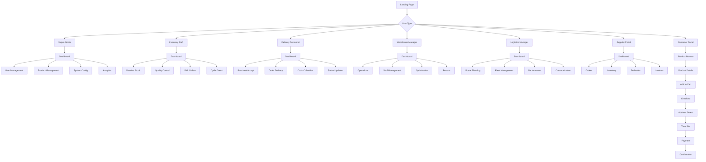

# 🥬 UI/UX Development Guide - ProModeAgro Fresh Fruits & Vegetables Management System

## 📋 Table of Contents

1. [Project Overview](#project-overview)
2. [Design System & Guidelines](#design-system--guidelines)
3. [User Personas & Journey Maps](#user-personas--journey-maps)
4. [Information Architecture](#information-architecture)
5. [Product Flow Tree](#product-flow-tree)
6. [Screen-by-Screen Design Specifications](#screen-by-screen-design-specifications)
7. [Component Library](#component-library)
8. [Responsive Design Guidelines](#responsive-design-guidelines)
9. [Accessibility Standards](#accessibility-standards)
10. [Implementation Guidelines](#implementation-guidelines)

---

## 1. Project Overview

### 🎯 **Product Vision**
ProModeAgro Fresh Fruits & Vegetables Management System is a comprehensive multi-role platform designed to streamline fresh produce inventory operations, delivery management, and customer interactions across Hyderabad's fresh produce supply chain.

### 👥 **Target Users**
- **Super Admin**: System administrators with full access
- **Inventory Staff**: Warehouse and inventory management personnel
- **Delivery Personnel**: Riders and delivery staff
- **Warehouse Manager**: Operations and logistics managers
- **Logistics Manager**: Route planning and fleet management
- **Supplier Portal**: External suppliers and vendors
- **Customer Portal**: End customers placing orders

### 🎨 **Design Philosophy**
- **Freshness First**: Quick access to perishable inventory data
- **Local Context**: Hyderabad-specific locations and preferences
- **Mobile-First**: Essential for field operations and customer orders
- **Seasonal Awareness**: Design adapts to fruit/vegetable seasons
- **Quality Focus**: Visual emphasis on freshness and quality indicators

---

## 2. Design System & Guidelines

### 🎨 **Color Palette**

#### **Primary Colors**
```css
--primary-green: #388E3C;      /* Fresh vegetable green */
--primary-light: #66BB6A;      /* Light fresh green */
--primary-dark: #2E7D32;       /* Deep vegetable green */
--primary-accent: #A5D6A7;     /* Mint accent */
```

#### **Secondary Colors**
```css
--secondary-orange: #FF8F00;   /* Citrus orange */
--secondary-red: #E53935;      /* Tomato red */
--secondary-purple: #8E24AA;   /* Eggplant purple */
--secondary-yellow: #FDD835;   /* Banana yellow */
```

#### **Neutral Colors**
```css
--neutral-white: #FFFFFF;      /* Background */
--neutral-light: #F5F5F5;      /* Light background */
--neutral-medium: #9E9E9E;     /* Borders/Dividers */
--neutral-dark: #424242;       /* Text */
--neutral-black: #212121;      /* Headers */
```

#### **Status Colors**
```css
--success: #4CAF50;            /* Fresh/Good quality */
--warning: #FF9800;            /* Ripening/Moderate quality */
--error: #F44336;              /* Spoiled/Poor quality */
--info: #2196F3;               /* Information */
--fresh: #66BB6A;              /* Ultra fresh produce */
--ripe: #FFA726;               /* Perfect ripeness */
--expiring: #EF5350;           /* Near expiry */
```

### 📝 **Typography**

#### **Font Family**
```css
--font-primary: 'Inter', -apple-system, BlinkMacSystemFont, 'Segoe UI', sans-serif;
--font-mono: 'JetBrains Mono', 'Fira Code', monospace;
```

#### **Font Scales**
```css
--text-xs: 0.75rem;    /* 12px - Captions */
--text-sm: 0.875rem;   /* 14px - Small text */
--text-base: 1rem;     /* 16px - Body text */
--text-lg: 1.125rem;   /* 18px - Large text */
--text-xl: 1.25rem;    /* 20px - Subheadings */
--text-2xl: 1.5rem;    /* 24px - Headings */
--text-3xl: 1.875rem;  /* 30px - Large headings */
--text-4xl: 2.25rem;   /* 36px - Page titles */
```

#### **Font Weights**
```css
--font-light: 300;
--font-normal: 400;
--font-medium: 500;
--font-semibold: 600;
--font-bold: 700;
```

### 📏 **Spacing System**
```css
--space-1: 0.25rem;    /* 4px */
--space-2: 0.5rem;     /* 8px */
--space-3: 0.75rem;    /* 12px */
--space-4: 1rem;       /* 16px */
--space-5: 1.25rem;    /* 20px */
--space-6: 1.5rem;     /* 24px */
--space-8: 2rem;       /* 32px */
--space-10: 2.5rem;    /* 40px */
--space-12: 3rem;      /* 48px */
--space-16: 4rem;      /* 64px */
```

### 🔲 **Border Radius**
```css
--radius-sm: 0.25rem;  /* 4px - Small elements */
--radius-md: 0.5rem;   /* 8px - Standard */
--radius-lg: 0.75rem;  /* 12px - Cards */
--radius-xl: 1rem;     /* 16px - Large cards */
--radius-full: 9999px; /* Circular */
```

### 🌊 **Shadows**
```css
--shadow-sm: 0 1px 2px 0 rgba(0, 0, 0, 0.05);
--shadow-md: 0 4px 6px -1px rgba(0, 0, 0, 0.1);
--shadow-lg: 0 10px 15px -3px rgba(0, 0, 0, 0.1);
--shadow-xl: 0 20px 25px -5px rgba(0, 0, 0, 0.1);
```

---

## 3. User Personas & Journey Maps

### 👤 **Primary Personas**

#### **Persona 1: Rajesh Kumar - Inventory Staff**
- **Age**: 28
- **Location**: Begumpet Wholesale Market, Hyderabad
- **Experience**: 3 years in fresh produce handling
- **Tech Comfort**: Medium
- **Goals**: Track freshness levels, minimize spoilage, quick quality checks
- **Pain Points**: Time-sensitive operations, quality assessment complexity
- **Device Usage**: Mobile/tablet in cold storage and market areas

#### **Persona 2: Priya Sharma - Delivery Personnel**
- **Age**: 25
- **Location**: Covers Banjara Hills, Jubilee Hills, Gachibowli
- **Experience**: 2 years in fresh produce delivery
- **Tech Comfort**: High
- **Goals**: Maintain cold chain, timely deliveries, customer satisfaction
- **Pain Points**: Traffic in Hyderabad, perishable item handling
- **Device Usage**: Mobile-only with GPS navigation

#### **Persona 3: Amit Patel - Warehouse Manager**
- **Age**: 35
- **Location**: Wholesale Market Complex, Gaddiannaram
- **Experience**: 8 years in perishable goods logistics
- **Tech Comfort**: High
- **Goals**: Minimize wastage, optimize cold storage, seasonal planning
- **Pain Points**: Monsoon season challenges, power outages affecting cold chain
- **Device Usage**: Desktop/laptop with mobile for field inspections

#### **Persona 4: Sunita Reddy - Customer**
- **Age**: 32
- **Location**: Kondapur, Hyderabad
- **Experience**: Regular online grocery shopper
- **Tech Comfort**: Medium-High
- **Goals**: Fresh produce delivery, seasonal fruits, competitive prices
- **Pain Points**: Quality concerns, delivery timing, seasonal availability
- **Device Usage**: Mobile-first for quick orders, desktop for bulk purchases

### 🗺️ **User Journey Maps**

#### **Customer Order Journey**
```
Browse Seasonal Produce → Check Freshness → Select Quantity → Choose Delivery Slot → Payment → Track Cold Chain → Receive Fresh → Rate Quality
```

#### **Inventory Staff Journey**
```
Login → Check Cold Storage → Receive Fresh Stock → Quality Assessment → Freshness Grading → Location Update → Pick Orders → Cold Chain Packing → Dispatch
```

#### **Delivery Personnel Journey**
```
Login → Cold Chain Check → Accept Routes → Navigate Hyderabad → Maintain Temperature → Deliver Fresh → Quality Confirmation → Settlement
```

---

## 4. Information Architecture

### 🏗️ **System Architecture**

```
ProModeAgro Fresh Fruits & Vegetables System
├── Authentication Layer
│   ├── Login/Logout
│   ├── Role-based Access
│   └── Session Management
├── Super Admin Portal
│   ├── Farmer/Supplier Management
│   ├── Fresh Produce Catalog
│   ├── Cold Chain Configuration
│   ├── Seasonal Analytics
│   └── Quality Standards
├── Inventory Staff Portal
│   ├── Fresh Stock Receiving
│   ├── Quality & Freshness Grading
│   ├── Cold Storage Management
│   ├── Expiry Tracking
│   └── Wastage Monitoring
├── Delivery Personnel Portal
│   ├── Cold Chain Runsheets
│   ├── Temperature Monitoring
│   ├── Hyderabad Route Navigation
│   ├── Fresh Delivery Confirmation
│   └── Quality Feedback
├── Warehouse Manager Portal
│   ├── Cold Storage Operations
│   ├── Seasonal Inventory Planning
│   ├── Wastage Analytics
│   ├── Temperature Monitoring
│   └── Freshness Reports
├── Logistics Manager Portal
│   ├── Hyderabad Route Optimization
│   ├── Cold Chain Fleet Management
│   ├── Delivery Time Slots
│   └── Customer Communication
├── Supplier/Farmer Portal
│   ├── Harvest Schedule Management
│   ├── Quality Certification Upload
│   ├── Seasonal Pricing Updates
│   ├── Delivery Coordination
│   └── Payment Tracking
└── Customer Portal
    ├── Seasonal Produce Browsing
    ├── Freshness Indicators
    ├── Hyderabad Area Selection
    ├── Cold Chain Delivery Slots
    ├── Quality Rating System
    └── Seasonal Recommendations
```

---

## 5. Product Flow Tree

### 🌳 **Complete System Flow**



---

## 6. Screen-by-Screen Design Specifications

### 🔐 **Authentication Screens**

#### **Login Screen**

**Layout Structure:**
```
┌─────────────────────────────────────┐
│              HEADER                 │
│         [ProModeAgro Logo]          │
│                                     │
│              LOGIN FORM             │
│  ┌─────────────────────────────────┐│
│  │  👤 User ID                     ││
│  │  [________________]             ││
│  │                                 ││
│  │  🔒 Password                    ││
│  │  [________________]             ││
│  │                                 ││
│  │  🔘 Remember Me                 ││
│  │                                 ││
│  │  [    LOGIN BUTTON    ]         ││
│  │                                 ││
│  │  Forgot Password?               ││
│  └─────────────────────────────────┘│
│                                     │
│              FOOTER                 │
│         © 2024 ProModeAgro          │
└─────────────────────────────────────┘
```

**Design Elements:**
- **Header**: 80px height, white background, centered logo
- **Form Container**: 400px width, centered, white background with shadow
- **Input Fields**: 48px height, rounded corners (8px), border on focus
- **Login Button**: 48px height, primary green, full width, rounded
- **Typography**: Inter font, 16px body text, 24px headings

**UX Guidelines:**
- Auto-focus on User ID field
- Show/hide password toggle
- Loading state on button click
- Error messages below respective fields
- Responsive: Stack vertically on mobile

#### **Role Selection Screen**

**Layout Structure:**
```
┌─────────────────────────────────────┐
│              HEADER                 │
│      Welcome, [User Name]           │
│                                     │
│         SELECT YOUR ROLE            │
│                                     │
│  ┌─────┐  ┌─────┐  ┌─────┐  ┌─────┐│
│  │ 👑  │  │ 📦  │  │ 🚚  │  │ 🏭  ││
│  │Admin│  │Inv. │  │Del. │  │Wh.  ││
│  │     │  │Staff│  │Pers.│  │Mgr. ││
│  └─────┘  └─────┘  └─────┘  └─────┘│
│                                     │
│  ┌─────┐  ┌─────┐  ┌─────┐         │
│  │ 🚛  │  │ 🏪  │  │ 👤  │         │
│  │Log. │  │Supp.│  │Cust.│         │
│  │Mgr. │  │Port.│  │Port.│         │
│  └─────┘  └─────┘  └─────┘         │
│                                     │
│              LOGOUT                 │
└─────────────────────────────────────┘
```

**Design Elements:**
- **Role Cards**: 120px × 120px, rounded corners, hover effects
- **Icons**: 48px size, consistent style
- **Grid Layout**: 4 columns on desktop, 2 on tablet, 1 on mobile
- **Spacing**: 24px between cards

**UX Guidelines:**
- Clear visual hierarchy with icons and labels
- Hover states with subtle elevation
- Keyboard navigation support
- Role-based access control validation

---

### 🛒 **Customer Portal Screens**

#### **Product Browsing Screen**

**Layout Structure:**
```
┌─────────────────────────────────────────────────────────────┐
│  HEADER: [🥬 ProModeAgro] [Search] [Cart(2)] [📍 Kondapur] │
├─────────────────────────────────────────────────────────────┤
│  BREADCRUMB: Home > Fresh Produce                           │
├─────────────────────────────────────────────────────────────┤
│ SIDEBAR        │              MAIN CONTENT                  │
│ ┌─────────────┐│ ┌─────────────────────────────────────────┐│
│ │ CATEGORIES  ││ │ SEASONAL HIGHLIGHTS                     ││
│ │ 🍎 Fruits   ││ │ 🥭 Mango Season | 🍇 Grapes Fresh      ││
│ │ 🥬 Vegetables││ │                                         ││
│ │ 🌿 Leafy    ││ │ PRODUCT GRID                            ││
│ │ 🥕 Root Veg ││ │ ┌─────┐ ┌─────┐ ┌─────┐ ┌─────┐        ││
│ │             ││ │ │🍅   │ │🥕   │ │🥬   │ │🍋   │        ││
│ │ FRESHNESS   ││ │ │Tomato│ │Carrot│ │Cabbage│ │Lemon│     ││
│ │ 🟢 Ultra    ││ │ │₹40/kg│ │₹60/kg│ │₹30/kg│ │₹80/kg│    ││
│ │ 🟡 Fresh    ││ │ │🟢Fresh│ │🟢Fresh│ │🟡Ripe│ │🟢Fresh│  ││
│ │ 🟠 Ripe     ││ │ │[🛒]  │ │[🛒]  │ │[🛒]  │ │[🛒]  │    ││
│ │             ││ │ └─────┘ └─────┘ └─────┘ └─────┘        ││
│ │ ORIGIN      ││ │                                         ││
│ │ □ Local Hyd ││ │ ┌─────┐ ┌─────┐ ┌─────┐ ┌─────┐        ││
│ │ □ Telangana ││ │ │🍌   │ │🥒   │ │🍆   │ │🌶️   │        ││
│ │ □ Karnataka ││ │ │Banana│ │Cucumber│ │Brinjal│ │Chilli│  ││
│ │             ││ │ │₹50/dz│ │₹25/kg│ │₹35/kg│ │₹120/kg│   ││
│ │ DELIVERY    ││ │ │🟡Ripe│ │🟢Fresh│ │🟢Fresh│ │🟢Fresh│  ││
│ │ 🚚 Today    ││ │ │[🛒]  │ │[🛒]  │ │[🛒]  │ │[🛒]  │    ││
│ │ 📅 Tomorrow ││ │ └─────┘ └─────┘ └─────┘ └─────┘        ││
│ └─────────────┘│ └─────────────────────────────────────────┘│
│                │     🌡️ Cold Chain Delivery Available       │
└─────────────────────────────────────────────────────────────┘
```

**Design Elements:**
- **Header**: 64px height, sticky, white background with shadow
- **Sidebar**: 280px width, collapsible on mobile
- **Product Cards**: 240px × 320px, rounded corners, hover effects
- **Grid**: 4 columns desktop, 2 tablet, 1 mobile
- **Images**: 240px × 180px, consistent aspect ratio

**UX Guidelines:**
- Infinite scroll or pagination options
- Quick add to cart without leaving page
- Filter persistence across sessions
- Loading states for images and content
- Sort options: Price, Rating, Popularity, New

#### **Product Details Screen**

**Layout Structure:**
```
┌─────────────────────────────────────────────────────────────┐
│  HEADER: [🥬 ProModeAgro] [Search] [Cart(2)] [📍 Kondapur] │
├─────────────────────────────────────────────────────────────┤
│  BREADCRUMB: Home > Vegetables > Tomatoes > Fresh Tomatoes │
├─────────────────────────────────────────────────────────────┤
│ PRODUCT IMAGES    │         PRODUCT INFO                    │
│ ┌───────────────┐ │ ┌─────────────────────────────────────┐ │
│ │               │ │ │ Fresh Red Tomatoes                  │ │
│ │  🍅 TOMATO    │ │ │ from Local Hyderabad Farms          │ │
│ │  MAIN IMAGE   │ │ │ ⭐⭐⭐⭐⭐ 4.8 (156 reviews)        │ │
│ │               │ │ │                                     │ │
│ └───────────────┘ │ │ ₹40/kg ₹50/kg (20% off)            │ │
│ [🖼️][🖼️][🖼️][🖼️] │ │                                     │ │
│                   │ │ FRESHNESS: 🟢 Ultra Fresh           │ │
│                   │ │ HARVEST: Today Morning              │ │
│                   │ │ ORIGIN: 📍 Ranga Reddy District    │ │
│                   │ │                                     │ │
│                   │ │ QUANTITY: [-] [2 kg] [+]            │ │
│                   │ │                                     │ │
│                   │ │ [  ADD TO CART  ] [❤️ WISHLIST]    │ │
│                   │ │                                     │ │
│                   │ │ 🌡️ Cold chain delivery available   │ │
│                   │ │ 🚚 Same day delivery in Hyderabad  │ │
│                   │ │ ✅ In stock (250 kg available)     │ │
│                   │ │ 📅 Best before: 3 days             │ │
│                   │ └─────────────────────────────────────┘ │
├─────────────────────────────────────────────────────────────┤
│                    PRODUCT DESCRIPTION                      │
│ Fresh, juicy tomatoes harvested this morning from organic  │
│ farms in Ranga Reddy district. Perfect for curries, salads │
│ and cooking. Rich in vitamins and antioxidants.            │
├─────────────────────────────────────────────────────────────┤
│                    CUSTOMER REVIEWS                        │
│ ⭐⭐⭐⭐⭐ 5.0 - "Super fresh! Delivered cold" - Priya K.   │
│ ⭐⭐⭐⭐⭐ 5.0 - "Best quality tomatoes" - Ravi S.         │
│ ⭐⭐⭐⭐○ 4.0 - "Good taste, quick delivery" - Meera R.    │
└─────────────────────────────────────────────────────────────┘
```

**Design Elements:**
- **Image Gallery**: 500px × 500px main image, 80px × 80px thumbnails
- **Product Info**: 400px width, sticky on scroll
- **Variant Selectors**: Radio buttons with visual indicators
- **CTA Buttons**: 48px height, primary and secondary styles
- **Trust Indicators**: Icons with short descriptive text

**UX Guidelines:**
- Image zoom on hover/tap
- Variant selection updates price and availability
- Quantity validation against stock
- Add to cart success feedback
- Related products section below
- Mobile: Stack images above product info

#### **Shopping Cart Screen**

**Layout Structure:**
```
┌─────────────────────────────────────────────────────────────┐
│  HEADER: [🥬 ProModeAgro] [Search] [Cart(4)] [📍 Kondapur] │
├─────────────────────────────────────────────────────────────┤
│  BREADCRUMB: Home > Shopping Cart                          │
├─────────────────────────────────────────────────────────────┤
│ CART ITEMS                    │    ORDER SUMMARY            │
│ ┌───────────────────────────┐ │ ┌─────────────────────────┐ │
│ │ [🍅] Fresh Red Tomatoes   │ │ │ Subtotal: ₹240          │ │
│ │       🟢 Ultra Fresh      │ │ │ Cold Chain: ₹20         │ │
│ │       ₹40/kg × 2kg = ₹80  │ │ │ Delivery: ₹0            │ │
│ │       [-] [2kg] [+] [🗑️]  │ │ │ ─────────────────────   │ │
│ └───────────────────────────┘ │ │ Total: ₹260             │ │
│                               │ │                         │ │
│ ┌───────────────────────────┐ │ │ DELIVERY SLOT           │ │
│ │ [🥕] Fresh Carrots        │ │ │ 📅 Today 6-9 PM        │ │
│ │       🟢 Farm Fresh       │ │ │ 🌡️ Cold Chain          │ │
│ │       ₹60/kg × 1kg = ₹60  │ │ │                         │ │
│ │       [-] [1kg] [+] [🗑️]  │ │ │ [   CHECKOUT   ]        │ │
│ └───────────────────────────┘ │ └─────────────────────────┘ │
│                               │                             │
│ ┌───────────────────────────┐ │    FRESHNESS GUARANTEE      │
│ │ [🥬] Fresh Cabbage        │ │    🌡️ Cold Chain Delivery  │
│ │       🟡 Ripe             │ │    ✅ Fresh or Refund       │
│ │       ₹30/kg × 1kg = ₹30  │ │    📞 Quality Support       │
│ │       [-] [1kg] [+] [🗑️]  │ │                             │
│ └───────────────────────────┘ │    ESTIMATED FRESHNESS      │
│                               │    🍅 Tomatoes: 3 days      │
│ ┌───────────────────────────┐ │    🥕 Carrots: 1 week       │
│ │ [🍋] Fresh Lemons         │ │    🥬 Cabbage: 5 days       │
│ │       🟢 Citrus Fresh     │ │    🍋 Lemons: 2 weeks       │
│ │       ₹80/kg × 0.5kg = ₹70│ │                             │
│ │       [-] [0.5kg] [+] [🗑️]│ │                             │
│ └───────────────────────────┘ │                             │
│                               │                             │
│ [← Continue Shopping]         │                             │
└─────────────────────────────────────────────────────────────┘
```

**Design Elements:**
- **Cart Items**: Full width on mobile, 2/3 width on desktop
- **Item Cards**: 48px height minimum, expandable
- **Quantity Controls**: Stepper with validation
- **Order Summary**: Sticky sidebar, 1/3 width desktop
- **Checkout Button**: Prominent, full width in summary

**UX Guidelines:**
- Real-time total updates
- Save for later option
- Bulk actions (select all, remove all)
- Stock validation on quantity change
- Persistent cart across sessions
- Empty cart state with recommendations

#### **Checkout Flow Screens**

##### **Address Selection Screen**

**Layout Structure:**
```
┌─────────────────────────────────────────────────────────────┐
│  CHECKOUT PROGRESS: [Cart] ●[Address] ○[Delivery] ○[Payment]│
├─────────────────────────────────────────────────────────────┤
│                    DELIVERY ADDRESS                         │
│                                                             │
│ ● Use Default Address                                       │
│ ┌─────────────────────────────────────────────────────────┐ │
│ │ 🏠 Home                                                 │ │
│ │ Flat 301, Green Valley Apartments                       │ │
│ │ Kondapur, Hyderabad, Telangana - 500084                │ │
│ │ Phone: +91 98765 43210                                  │ │
│ │ 🌡️ Cold Chain Available | 🚚 Same Day Delivery        │ │
│ │                                        [Edit] [Delete]  │ │
│ └─────────────────────────────────────────────────────────┘ │
│                                                             │
│ ○ Office Address                                            │
│ ┌─────────────────────────────────────────────────────────┐ │
│ │ 🏢 Office                                               │ │
│ │ Tech Mahindra, Hitech City                              │ │
│ │ Madhapur, Hyderabad, Telangana - 500081                │ │
│ │ Phone: +91 98765 43210                                  │ │
│ │ 🌡️ Cold Chain Available | 🚚 Same Day Delivery        │ │
│ │                                        [Edit] [Delete]  │ │
│ └─────────────────────────────────────────────────────────┘ │
│                                                             │
│ ○ Parents' Home                                             │
│ ┌─────────────────────────────────────────────────────────┐ │
│ │ 🏡 Family                                               │ │
│ │ House No. 12-34, Jubilee Hills                          │ │
│ │ Hyderabad, Telangana - 500033                           │ │
│ │ Phone: +91 98765 43211                                  │ │
│ │ 🌡️ Cold Chain Available | 🚚 Same Day Delivery        │ │
│ │                                        [Edit] [Delete]  │ │
│ └─────────────────────────────────────────────────────────┘ │
│                                                             │
│ [+ Add New Address in Hyderabad]                           │
│                                                             │
│                    [Continue to Time Slots]                │
└─────────────────────────────────────────────────────────────┘
```

##### **Time Slot Selection Screen**

**Layout Structure:**
```
┌─────────────────────────────────────────────────────────────┐
│  CHECKOUT PROGRESS: [Cart] [Address] ●[Delivery] ○[Payment]│
├─────────────────────────────────────────────────────────────┤
│                    COLD CHAIN DELIVERY SLOTS               │
│                                                             │
│ 📍 Delivering to: Kondapur, Hyderabad - 500084             │
│ 🌍 Zone: Hyderabad Metro (Cold Chain Available)            │
│ 🌡️ Temperature Controlled: 2-8°C                           │
│                                                             │
│ TODAY - Jan 20, 2024 (Saturday)                            │
│ ┌─────────────────────────────────────────────────────────┐ │
│ │ ○ 6:00 PM - 9:00 PM    🌡️ Cold Chain    FREE          │ │
│ │   Fresh produce delivered within 4 hours of harvest     │ │
│ └─────────────────────────────────────────────────────────┘ │
│                                                             │
│ TOMORROW - Jan 21, 2024 (Sunday)                           │
│ ┌─────────────────────────────────────────────────────────┐ │
│ │ ● 6:00 AM - 9:00 AM    🌡️ Cold Chain    FREE          │ │
│ │   Early morning fresh delivery from wholesale market    │ │
│ └─────────────────────────────────────────────────────────┘ │
│ ┌─────────────────────────────────────────────────────────┐ │
│ │ ○ 2:00 PM - 5:00 PM    🌡️ Cold Chain    FREE          │ │
│ │   Afternoon delivery with temperature monitoring        │ │
│ └─────────────────────────────────────────────────────────┘ │
│ ┌─────────────────────────────────────────────────────────┐ │
│ │ ○ 6:00 PM - 9:00 PM    🌡️ Cold Chain    FREE          │ │
│ │   Evening delivery perfect for working professionals    │ │
│ └─────────────────────────────────────────────────────────┘ │
│                                                             │
│ 🚚 Delivery Coverage: Kondapur, Gachibowli, Madhapur,     │
│     Jubilee Hills, Banjara Hills, Hitech City              │
│                                                             │
│                    [Continue to Payment]                   │
└─────────────────────────────────────────────────────────────┘
```

##### **Payment Method Screen**

**Layout Structure:**
```
┌─────────────────────────────────────────────────────────────┐
│  CHECKOUT PROGRESS: [Cart] [Address] [Delivery] ●[Payment] │
├─────────────────────────────────────────────────────────────┤
│                    PAYMENT METHODS                          │
│                                                             │
│ ● Cash on Delivery                                          │
│ ┌─────────────────────────────────────────────────────────┐ │
│ │ 💵 Pay when order is delivered                          │ │
│ │ No additional charges                                    │ │
│ └─────────────────────────────────────────────────────────┘ │
│                                                             │
│ ○ UPI Payment                                               │
│ ┌─────────────────────────────────────────────────────────┐ │
│ │ 📱 PhonePe, GPay, Paytm, BHIM                           │ │
│ │ Instant payment confirmation                             │ │
│ └─────────────────────────────────────────────────────────┘ │
│                                                             │
│ ○ Credit/Debit Card                                         │
│ ┌─────────────────────────────────────────────────────────┐ │
│ │ 💳 Visa, Mastercard, RuPay                              │ │
│ │ Secure 3D authentication                                 │ │
│ └─────────────────────────────────────────────────────────┘ │
│                                                             │
│ ○ Net Banking                                               │
│ ○ Digital Wallets                                           │
│                                                             │
│                    [Place Order]                           │
└─────────────────────────────────────────────────────────────┘
```

---

### 📦 **Inventory Staff Portal Screens**

#### **Dashboard Screen**

**Layout Structure:**
```
┌─────────────────────────────────────────────────────────────┐
│  HEADER: [🥬 ProModeAgro] Inventory Staff [📍 Begumpet] [⚙️]│
├─────────────────────────────────────────────────────────────┤
│ SIDEBAR    │                MAIN CONTENT                    │
│ ┌────────┐ │ ┌─────────────────────────────────────────────┐ │
│ │🌡️ Cold │ │ │           FRESHNESS OVERVIEW                │ │
│ │📦 Fresh│ │ │ ┌─────┐ ┌─────┐ ┌─────┐ ┌─────┐            │ │
│ │🔍 Scan │ │ │ │ 2.5T │ │ 156 │ │  23 │ │  4  │            │ │
│ │📋 Orders│ │ │ │Fresh │ │Orders│ │Expiring│ │Spoiled│       │ │
│ │📊 Reports│ │ │ │Stock │ │Today │ │Soon │ │Items │         │ │
│ │⚙️ Settings│ │ │ └─────┘ └─────┘ └─────┘ └─────┘            │ │
│ └────────┘ │ └─────────────────────────────────────────────┘ │
│            │                                                 │
│            │ ┌─────────────────────────────────────────────┐ │
│            │ │           TODAY'S PRIORITY TASKS            │ │
│            │ │ 🔴 Quality check expiring tomatoes (2 hrs)  │ │
│            │ │ 🟡 Receive fresh leafy vegetables (6 AM)    │ │
│            │ │ 🟢 Pick orders for Kondapur route           │ │
│            │ │ 🟠 Cold storage temperature check           │ │
│            │ │ 🔵 Update locations for new arrivals        │ │
│            │ └─────────────────────────────────────────────┘ │
│            │                                                 │
│            │ ┌─────────────────────────────────────────────┐ │
│            │ │           RECENT ACTIVITY                   │ │
│            │ │ 10:30 AM - Received 50kg fresh tomatoes 🍅  │ │
│            │ │ 10:15 AM - Quality ✅ passed for carrots    │ │
│            │ │ 09:45 AM - Picked order for Gachibowli      │ │
│            │ │ 09:30 AM - Cold storage temp: 4°C ✅        │ │
│            │ │ 09:15 AM - Marked 5kg onions as Grade-A     │ │
│            │ └─────────────────────────────────────────────┘ │
│            │                                                 │
│            │ ┌─────────────────────────────────────────────┐ │
│            │ │           TEMPERATURE ALERTS                │ │
│            │ │ 🌡️ Cold Storage 1: 3.8°C ✅ Optimal        │ │
│            │ │ 🌡️ Cold Storage 2: 4.2°C ✅ Optimal        │ │
│            │ │ 🌡️ Loading Bay: 6.1°C ⚠️ Monitor          │ │
│            │ └─────────────────────────────────────────────┘ │
└─────────────────────────────────────────────────────────────┘
```

#### **Stock Receiving Screen**

**Layout Structure:**
```
┌─────────────────────────────────────────────────────────────┐
│  HEADER: [🥬 ProModeAgro] Fresh Stock Receiving [📍 Begumpet]│
├─────────────────────────────────────────────────────────────┤
│                    SCAN FRESH PRODUCE                       │
│                                                             │
│ ┌─────────────────────────────────────────────────────────┐ │
│ │               📷 CAMERA VIEW                            │ │
│ │                                                         │ │
│ │           [Scan Produce Code/QR]                        │ │
│ │                                                         │ │
│ │              OR SELECT MANUALLY                         │ │
│ │           [🍅 Tomatoes] [🥕 Carrots] [🥬 Leafy]        │ │
│ └─────────────────────────────────────────────────────────┘ │
│                                                             │
│ FRESH PRODUCE DETAILS (After Selection)                    │
│ ┌─────────────────────────────────────────────────────────┐ │
│ │ Product: 🍅 Fresh Red Tomatoes                          │ │
│ │ Variety: Hybrid Tomatoes                                │ │
│ │ Category: Vegetables                                    │ │
│ │ Expected: 100 kg from Ranga Reddy Farms                │ │
│ │                                                         │ │
│ │ Received Weight: [____] kg                              │ │
│ │ Freshness Grade: ○🟢 Ultra ○🟡 Fresh ○🟠 Ripe ○🔴 Poor│ │
│ │ Harvest Date: [DD/MM/YYYY] (Auto: Today)               │ │
│ │ Farmer/Supplier: [Ranga Reddy Organic Farms]           │ │
│ │ Cold Storage: [CS-1] [CS-2] [Loading Bay]              │ │
│ │ Best Before: [Auto-calculated: 3 days]                 │ │
│ │                                                         │ │
│ │ 🌡️ Arrival Temperature: [____]°C                       │ │
│ │ Quality Notes: [Firmness, color, damage assessment...] │ │
│ │                                                         │ │
│ │ 📸 [Take Quality Photos] [Upload Certificates]         │ │
│ │                                                         │ │
│ │     [✅ Accept & Store] [❌ Reject] [🔄 Next Batch]    │ │
│ └─────────────────────────────────────────────────────────┘ │
│                                                             │
│ 🌡️ Current Cold Storage Temp: 3.8°C ✅                    │
│ 📊 Today's Received: 2.3T | Rejected: 45kg | Quality: 96% │
└─────────────────────────────────────────────────────────────┘
```

---

### 🚚 **Delivery Personnel Portal Screens**

#### **Runsheet Management Screen**

**Layout Structure:**
```
┌─────────────────────────────────────────────────────────────┐
│  HEADER: [🥬 ProModeAgro] Cold Chain Delivery [🌡️ 4.2°C]   │
├─────────────────────────────────────────────────────────────┤
│                    TODAY'S FRESH RUNSHEET                   │
│                                                             │
│ Route: HYD-KP-001 | Orders: 8 | Est: 4hrs | 🌡️ Monitored  │
│ Coverage: Kondapur → Gachibowli → Madhapur → Hitech City   │
│                                                             │
│ ┌─────────────────────────────────────────────────────────┐ │
│ │ ORDER #1                              Status: In Transit │ │
│ │ ORD-HYD-20240120-001                                    │ │
│ │ 📍 Green Valley Apartments, Kondapur - 500084           │ │
│ │ 📞 +91 98765 43210 (Sunita Reddy)                      │ │
│ │ 💰 ₹260 (COD) | 🌡️ Cold Chain Required                 │ │
│ │ 📦 🍅 2kg Tomatoes, 🥕 1kg Carrots, 🥬 1kg Cabbage     │ │
│ │ ⏰ 6:00 AM - 9:00 AM | 📅 Best Before: 3 days          │ │
│ │                                                         │ │
│ │ [📍 Navigate] [📞 Call] [✅ Delivered] [❌ Failed]      │ │
│ │ [🌡️ Temp Check] [📸 Quality Photo]                     │ │
│ └─────────────────────────────────────────────────────────┘ │
│                                                             │
│ ┌─────────────────────────────────────────────────────────┐ │
│ │ ORDER #2                              Status: Delivered │ │
│ │ ORD-HYD-20240120-002                                    │ │
│ │ 📍 Tech Mahindra, Hitech City - 500081                 │ │
│ │ 📞 +91 98765 43211 (Rajesh Kumar)                      │ │
│ │ 💰 ₹180 (Paid Online) | 🌡️ Delivered Cold              │ │
│ │ 📦 🍋 0.5kg Lemons, 🌶️ 0.5kg Green Chillies           │ │
│ │ ⏰ 6:00 AM - 9:00 AM                                    │ │
│ │ ✅ Delivered at 7:45 AM | 🌡️ Temp: 3.9°C ✅            │ │
│ │ ⭐ Customer Rating: 5/5 "Super fresh!"                  │ │
│ └─────────────────────────────────────────────────────────┘ │
│                                                             │
│ [📊 Route Summary] [💰 Cash: ₹1,240] [🌡️ Temp Log]       │
│ [📱 Support] [🚚 Vehicle Status] [⛽ Fuel: 78%]            │
└─────────────────────────────────────────────────────────────┘
```

#### **Order Delivery Screen**

**Layout Structure:**
```
┌─────────────────────────────────────────────────────────────┐
│  HEADER: [Logo] Order Delivery [Profile][Logout]           │
├─────────────────────────────────────────────────────────────┤
│                    ORDER DETAILS                            │
│                                                             │
│ Order ID: ORD-20240120-001                                  │
│ Customer: John Doe                                          │
│ Phone: +91 98765 43210                                      │
│ Address: 123 Main Street, Mumbai - 400001                   │
│                                                             │
│ ┌─────────────────────────────────────────────────────────┐ │
│ │                    ITEMS TO DELIVER                     │ │
│ │ ☐ Premium Cotton T-Shirt (Size: M, Color: Blue) × 2    │ │
│ │ ☐ Organic Rice (Weight: 5kg) × 1                       │ │
│ │                                                         │ │
│ │ Total Amount: ₹1,299                                    │ │
│ │ Payment Method: Cash on Delivery                        │ │
│ └─────────────────────────────────────────────────────────┘ │
│                                                             │
│ DELIVERY STATUS                                             │
│ ● Delivered Successfully                                    │
│ ○ Delivery Failed                                           │
│ ○ Partial Delivery                                          │
│ ○ Customer Not Available                                    │
│                                                             │
│ PROOF OF DELIVERY                                           │
│ ┌─────────────────────────────────────────────────────────┐ │
│ │ 📷 Take Photo                                           │ │
│ │ ✍️ Get Signature                                        │ │
│ │ 📝 Customer Name: [_____________]                       │ │
│ │ 📱 OTP Verification: [____]                             │ │
│ └─────────────────────────────────────────────────────────┘ │
│                                                             │
│ Cash Collected: ₹[_____]                                    │
│ Notes: [Optional delivery notes...]                         │
│                                                             │
│                    [Complete Delivery]                     │
└─────────────────────────────────────────────────────────────┘
```

---

### 🏭 **Warehouse Manager Portal Screens**

#### **Operations Dashboard**

**Layout Structure:**
```
┌─────────────────────────────────────────────────────────────┐
│  HEADER: [🥬 ProModeAgro] Cold Chain Operations [📍 Gaddiannaram]│
├─────────────────────────────────────────────────────────────┤
│ SIDEBAR         │              MAIN DASHBOARD               │
│ ┌─────────────┐ │ ┌─────────────────────────────────────────┐ │
│ │🌡️ Cold Chain│ │ │           FRESHNESS KPIs                │ │
│ │👥 Staff     │ │ │ ┌─────┐ ┌─────┐ ┌─────┐ ┌─────┐        │ │
│ │📦 Fresh Inv │ │ │ │ 97% │ │ 3.2T│ │ 156 │ │ 2.1%│        │ │
│ │🔄 Operations│ │ │ │Fresh │ │Daily│ │Orders│ │Waste│        │ │
│ │📈 Analytics │ │ │ │Rate  │ │Vol. │ │Today │ │Rate │        │ │
│ │⚙️ Settings  │ │ │ └─────┘ └─────┘ └─────┘ └─────┘        │ │
│ └─────────────┘ │ └─────────────────────────────────────────┘ │
│                 │                                           │
│                 │ ┌─────────────────────────────────────────┐ │
│                 │ │           COLD STORAGE STATUS           │ │
│                 │ │ ┌─────────────────────────────────────┐ │ │
│                 │ │ │ CS-1 🌡️ 3.8°C │ 85% Full │ ✅ Optimal│ │ │
│                 │ │ │ CS-2 🌡️ 4.1°C │ 72% Full │ ✅ Optimal│ │ │
│                 │ │ │ CS-3 🌡️ 4.3°C │ 91% Full │ ⚠️ Monitor│ │ │
│                 │ │ │ Loading Bay    │ 15°C     │ 🔴 High   │ │ │
│                 │ │ └─────────────────────────────────────┘ │ │
│                 │ └─────────────────────────────────────────┘ │
│                 │                                           │
│                 │ ┌─────────────────────────────────────────┐ │
│                 │ │           FRESHNESS ALERTS              │ │
│                 │ │ 🔴 URGENT: 50kg Tomatoes expire in 4hrs │ │
│                 │ │ 🟡 MONITOR: Leafy vegetables (12 hrs)   │ │
│                 │ │ ⚠️ TEMP ALERT: Loading bay too warm     │ │
│                 │ │ 📦 RESTOCK: Onions running low (20kg)   │ │
│                 │ │ 🌡️ POWER: Backup generator on standby   │ │
│                 │ └─────────────────────────────────────────┘ │
│                 │                                           │
│                 │ ┌─────────────────────────────────────────┐ │
│                 │ │           HYDERABAD ROUTES STATUS       │ │
│                 │ │ 🚚 Route HYD-KP: 8 orders, On-time     │ │
│                 │ │ 🚚 Route HYD-JH: 6 orders, Delayed 15m │ │
│                 │ │ 🚚 Route HYD-HC: 12 orders, In-transit │ │
│                 │ │ 🚚 Route HYD-BH: 4 orders, Completed   │ │
│                 │ └─────────────────────────────────────────┘ │
└─────────────────────────────────────────────────────────────┘
```

---

## 7. Component Library

### 🧩 **Core Components**

#### **Buttons**

```css
/* Primary Button */
.btn-primary {
  background: var(--primary-green);
  color: white;
  border: none;
  padding: 12px 24px;
  border-radius: var(--radius-md);
  font-weight: var(--font-medium);
  cursor: pointer;
  transition: all 0.2s ease;
}

.btn-primary:hover {
  background: var(--primary-dark);
  transform: translateY(-1px);
  box-shadow: var(--shadow-md);
}

/* Secondary Button */
.btn-secondary {
  background: transparent;
  color: var(--primary-green);
  border: 2px solid var(--primary-green);
  padding: 10px 22px;
  border-radius: var(--radius-md);
  font-weight: var(--font-medium);
  cursor: pointer;
  transition: all 0.2s ease;
}

.btn-secondary:hover {
  background: var(--primary-green);
  color: white;
}

/* Icon Button */
.btn-icon {
  background: none;
  border: none;
  padding: 8px;
  border-radius: var(--radius-full);
  cursor: pointer;
  transition: all 0.2s ease;
}

.btn-icon:hover {
  background: var(--neutral-light);
}
```

#### **Form Elements**

```css
/* Input Field */
.input-field {
  width: 100%;
  padding: 12px 16px;
  border: 2px solid var(--neutral-medium);
  border-radius: var(--radius-md);
  font-size: var(--text-base);
  transition: border-color 0.2s ease;
}

.input-field:focus {
  outline: none;
  border-color: var(--primary-green);
  box-shadow: 0 0 0 3px rgba(46, 125, 50, 0.1);
}

.input-field.error {
  border-color: var(--error);
}

/* Select Dropdown */
.select-field {
  position: relative;
  width: 100%;
}

.select-field select {
  width: 100%;
  padding: 12px 16px;
  border: 2px solid var(--neutral-medium);
  border-radius: var(--radius-md);
  background: white;
  cursor: pointer;
}

/* Checkbox */
.checkbox {
  display: flex;
  align-items: center;
  gap: 8px;
  cursor: pointer;
}

.checkbox input[type="checkbox"] {
  width: 18px;
  height: 18px;
  accent-color: var(--primary-green);
}

/* Radio Button */
.radio {
  display: flex;
  align-items: center;
  gap: 8px;
  cursor: pointer;
}

.radio input[type="radio"] {
  width: 18px;
  height: 18px;
  accent-color: var(--primary-green);
}
```

#### **Cards**

```css
/* Base Card */
.card {
  background: white;
  border-radius: var(--radius-lg);
  box-shadow: var(--shadow-sm);
  padding: var(--space-6);
  transition: all 0.2s ease;
}

.card:hover {
  box-shadow: var(--shadow-md);
  transform: translateY(-2px);
}

/* Product Card */
.product-card {
  background: white;
  border-radius: var(--radius-lg);
  overflow: hidden;
  box-shadow: var(--shadow-sm);
  transition: all 0.2s ease;
}

.product-card:hover {
  box-shadow: var(--shadow-lg);
  transform: translateY(-4px);
}

.product-card img {
  width: 100%;
  height: 200px;
  object-fit: cover;
}

.product-card-content {
  padding: var(--space-4);
}

/* Status Card */
.status-card {
  background: white;
  border-radius: var(--radius-lg);
  padding: var(--space-6);
  text-align: center;
  box-shadow: var(--shadow-sm);
}

.status-card.success {
  border-left: 4px solid var(--success);
}

.status-card.warning {
  border-left: 4px solid var(--warning);
}

.status-card.error {
  border-left: 4px solid var(--error);
}
```

#### **Navigation**

```css
/* Header */
.header {
  height: 64px;
  background: white;
  box-shadow: var(--shadow-sm);
  display: flex;
  align-items: center;
  justify-content: space-between;
  padding: 0 var(--space-6);
  position: sticky;
  top: 0;
  z-index: 100;
}

.header-logo {
  height: 40px;
}

.header-nav {
  display: flex;
  align-items: center;
  gap: var(--space-6);
}

/* Sidebar */
.sidebar {
  width: 280px;
  height: 100vh;
  background: white;
  box-shadow: var(--shadow-sm);
  padding: var(--space-6);
  position: fixed;
  left: 0;
  top: 64px;
}

.sidebar-nav {
  list-style: none;
  padding: 0;
  margin: 0;
}

.sidebar-nav li {
  margin-bottom: var(--space-2);
}

.sidebar-nav a {
  display: flex;
  align-items: center;
  gap: var(--space-3);
  padding: var(--space-3);
  border-radius: var(--radius-md);
  text-decoration: none;
  color: var(--neutral-dark);
  transition: all 0.2s ease;
}

.sidebar-nav a:hover,
.sidebar-nav a.active {
  background: var(--primary-light);
  color: white;
}

/* Breadcrumb */
.breadcrumb {
  display: flex;
  align-items: center;
  gap: var(--space-2);
  padding: var(--space-4) var(--space-6);
  background: var(--neutral-light);
  font-size: var(--text-sm);
}

.breadcrumb a {
  color: var(--primary-green);
  text-decoration: none;
}

.breadcrumb span {
  color: var(--neutral-dark);
}
```

#### **Data Display**

```css
/* Table */
.table {
  width: 100%;
  border-collapse: collapse;
  background: white;
  border-radius: var(--radius-lg);
  overflow: hidden;
  box-shadow: var(--shadow-sm);
}

.table th {
  background: var(--neutral-light);
  padding: var(--space-4);
  text-align: left;
  font-weight: var(--font-semibold);
  color: var(--neutral-dark);
}

.table td {
  padding: var(--space-4);
  border-bottom: 1px solid var(--neutral-light);
}

.table tr:hover {
  background: var(--neutral-light);
}

/* Badge */
.badge {
  display: inline-flex;
  align-items: center;
  padding: 4px 8px;
  border-radius: var(--radius-full);
  font-size: var(--text-xs);
  font-weight: var(--font-medium);
  text-transform: uppercase;
}

.badge.success {
  background: rgba(76, 175, 80, 0.1);
  color: var(--success);
}

.badge.warning {
  background: rgba(255, 152, 0, 0.1);
  color: var(--warning);
}

.badge.error {
  background: rgba(244, 67, 54, 0.1);
  color: var(--error);
}

/* Progress Bar */
.progress {
  width: 100%;
  height: 8px;
  background: var(--neutral-light);
  border-radius: var(--radius-full);
  overflow: hidden;
}

.progress-bar {
  height: 100%;
  background: var(--primary-green);
  transition: width 0.3s ease;
}
```

#### **Feedback Components**

```css
/* Alert */
.alert {
  padding: var(--space-4);
  border-radius: var(--radius-md);
  margin-bottom: var(--space-4);
  display: flex;
  align-items: center;
  gap: var(--space-3);
}

.alert.success {
  background: rgba(76, 175, 80, 0.1);
  border: 1px solid var(--success);
  color: var(--success);
}

.alert.warning {
  background: rgba(255, 152, 0, 0.1);
  border: 1px solid var(--warning);
  color: var(--warning);
}

.alert.error {
  background: rgba(244, 67, 54, 0.1);
  border: 1px solid var(--error);
  color: var(--error);
}

/* Modal */
.modal-overlay {
  position: fixed;
  top: 0;
  left: 0;
  right: 0;
  bottom: 0;
  background: rgba(0, 0, 0, 0.5);
  display: flex;
  align-items: center;
  justify-content: center;
  z-index: 1000;
}

.modal {
  background: white;
  border-radius: var(--radius-lg);
  padding: var(--space-6);
  max-width: 500px;
  width: 90%;
  max-height: 90vh;
  overflow-y: auto;
  box-shadow: var(--shadow-xl);
}

.modal-header {
  display: flex;
  align-items: center;
  justify-content: space-between;
  margin-bottom: var(--space-4);
}

.modal-title {
  font-size: var(--text-xl);
  font-weight: var(--font-semibold);
  color: var(--neutral-black);
}

/* Toast */
.toast {
  position: fixed;
  top: var(--space-6);
  right: var(--space-6);
  background: white;
  border-radius: var(--radius-md);
  padding: var(--space-4);
  box-shadow: var(--shadow-lg);
  display: flex;
  align-items: center;
  gap: var(--space-3);
  z-index: 1100;
  animation: slideIn 0.3s ease;
}

@keyframes slideIn {
  from {
    transform: translateX(100%);
    opacity: 0;
  }
  to {
    transform: translateX(0);
    opacity: 1;
  }
}
```

---

## 8. Responsive Design Guidelines

### 📱 **Breakpoints**

```css
/* Mobile First Approach */
:root {
  --breakpoint-sm: 640px;   /* Small devices */
  --breakpoint-md: 768px;   /* Medium devices */
  --breakpoint-lg: 1024px;  /* Large devices */
  --breakpoint-xl: 1280px;  /* Extra large devices */
  --breakpoint-2xl: 1536px; /* 2X large devices */
}

/* Media Queries */
@media (min-width: 640px) { /* sm */ }
@media (min-width: 768px) { /* md */ }
@media (min-width: 1024px) { /* lg */ }
@media (min-width: 1280px) { /* xl */ }
@media (min-width: 1536px) { /* 2xl */ }
```

### 📐 **Layout Patterns**

#### **Grid System**
```css
.container {
  width: 100%;
  max-width: 1200px;
  margin: 0 auto;
  padding: 0 var(--space-4);
}

.grid {
  display: grid;
  gap: var(--space-4);
}

.grid-cols-1 { grid-template-columns: repeat(1, 1fr); }
.grid-cols-2 { grid-template-columns: repeat(2, 1fr); }
.grid-cols-3 { grid-template-columns: repeat(3, 1fr); }
.grid-cols-4 { grid-template-columns: repeat(4, 1fr); }

@media (min-width: 768px) {
  .md\:grid-cols-2 { grid-template-columns: repeat(2, 1fr); }
  .md\:grid-cols-3 { grid-template-columns: repeat(3, 1fr); }
  .md\:grid-cols-4 { grid-template-columns: repeat(4, 1fr); }
}

@media (min-width: 1024px) {
  .lg\:grid-cols-3 { grid-template-columns: repeat(3, 1fr); }
  .lg\:grid-cols-4 { grid-template-columns: repeat(4, 1fr); }
  .lg\:grid-cols-5 { grid-template-columns: repeat(5, 1fr); }
}
```

#### **Responsive Navigation**
```css
/* Mobile Navigation */
@media (max-width: 767px) {
  .sidebar {
    transform: translateX(-100%);
    transition: transform 0.3s ease;
  }
  
  .sidebar.open {
    transform: translateX(0);
  }
  
  .mobile-menu-toggle {
    display: block;
  }
  
  .desktop-nav {
    display: none;
  }
}

/* Desktop Navigation */
@media (min-width: 768px) {
  .sidebar {
    transform: translateX(0);
  }
  
  .mobile-menu-toggle {
    display: none;
  }
  
  .desktop-nav {
    display: flex;
  }
}
```

### 📱 **Mobile-Specific Guidelines**

#### **Touch Targets**
- Minimum 44px × 44px for touch targets
- 8px minimum spacing between touch targets
- Larger targets for primary actions (48px+)

#### **Typography Scaling**
```css
/* Mobile Typography */
@media (max-width: 767px) {
  .text-4xl { font-size: 1.875rem; } /* 30px */
  .text-3xl { font-size: 1.5rem; }   /* 24px */
  .text-2xl { font-size: 1.25rem; }  /* 20px */
  .text-xl { font-size: 1.125rem; }  /* 18px */
}
```

#### **Mobile Layout Patterns**
```css
/* Stack on Mobile */
@media (max-width: 767px) {
  .mobile-stack {
    flex-direction: column;
  }
  
  .mobile-full-width {
    width: 100%;
  }
  
  .mobile-hidden {
    display: none;
  }
}
```

---

## 9. Accessibility Standards

### ♿ **WCAG 2.1 AA Compliance**

#### **Color Contrast Requirements**
- Normal text: 4.5:1 minimum contrast ratio
- Large text (18pt+): 3:1 minimum contrast ratio
- Non-text elements: 3:1 minimum contrast ratio

#### **Color Accessibility**
```css
/* Ensure sufficient contrast */
.text-primary { color: #1B5E20; } /* 7.2:1 on white */
.text-secondary { color: #424242; } /* 6.1:1 on white */
.text-muted { color: #616161; } /* 4.5:1 on white */

/* Don't rely on color alone */
.status-success {
  color: var(--success);
}
.status-success::before {
  content: "✓ ";
}

.status-error {
  color: var(--error);
}
.status-error::before {
  content: "✗ ";
}
```

#### **Keyboard Navigation**
```css
/* Focus indicators */
*:focus {
  outline: 2px solid var(--primary-green);
  outline-offset: 2px;
}

/* Skip links */
.skip-link {
  position: absolute;
  top: -40px;
  left: 6px;
  background: var(--primary-green);
  color: white;
  padding: 8px;
  text-decoration: none;
  border-radius: 4px;
  z-index: 1000;
}

.skip-link:focus {
  top: 6px;
}
```

#### **Screen Reader Support**
```html
<!-- Semantic HTML -->
<main role="main">
  <h1>Page Title</h1>
  <nav aria-label="Main navigation">
    <ul>
      <li><a href="#" aria-current="page">Dashboard</a></li>
    </ul>
  </nav>
</main>

<!-- ARIA Labels -->
<button aria-label="Close dialog">×</button>
<input type="search" aria-label="Search products">

<!-- Live Regions -->
<div aria-live="polite" id="status-messages"></div>
<div aria-live="assertive" id="error-messages"></div>

<!-- Form Labels -->
<label for="email">Email Address</label>
<input type="email" id="email" required aria-describedby="email-help">
<div id="email-help">We'll never share your email</div>
```

#### **Motion and Animation**
```css
/* Respect reduced motion preference */
@media (prefers-reduced-motion: reduce) {
  *,
  *::before,
  *::after {
    animation-duration: 0.01ms !important;
    animation-iteration-count: 1 !important;
    transition-duration: 0.01ms !important;
  }
}
```

---

## 10. Implementation Guidelines

### 🛠️ **Technology Stack Recommendations**

#### **Frontend Framework**
- **React 18+** with TypeScript
- **Next.js 14+** for SSR/SSG capabilities
- **Tailwind CSS** for utility-first styling
- **Framer Motion** for animations
- **React Hook Form** for form management
- **React Query** for data fetching

#### **State Management**
- **Zustand** for global state
- **React Context** for theme/auth
- **React Hook Form** for form state

#### **UI Component Libraries**
- **Headless UI** for accessible components
- **Radix UI** for complex components
- **React Icons** for consistent iconography
- **React Hot Toast** for notifications

### 📁 **Project Structure**
```
src/
├── components/
│   ├── ui/              # Base UI components
│   ├── forms/           # Form components
│   ├── layout/          # Layout components
│   └── features/        # Feature-specific components
├── pages/               # Next.js pages
├── hooks/               # Custom React hooks
├── utils/               # Utility functions
├── types/               # TypeScript types
├── styles/              # Global styles
├── constants/           # App constants
└── lib/                 # Third-party configurations
```

### 🎨 **CSS Architecture**

#### **Utility-First with Custom Components**
```css
/* Base styles */
@tailwind base;
@tailwind components;
@tailwind utilities;

/* Custom component classes */
@layer components {
  .btn-primary {
    @apply bg-primary-green text-white px-6 py-3 rounded-lg font-medium;
    @apply hover:bg-primary-dark transition-colors duration-200;
    @apply focus:outline-none focus:ring-2 focus:ring-primary-green focus:ring-offset-2;
  }
  
  .card {
    @apply bg-white rounded-xl shadow-sm p-6;
    @apply hover:shadow-md transition-shadow duration-200;
  }
}
```

#### **CSS Custom Properties Integration**
```css
:root {
  --color-primary-green: 46 125 50;
  --color-primary-light: 76 175 80;
  --color-primary-dark: 27 94 32;
}

/* Tailwind config */
module.exports = {
  theme: {
    extend: {
      colors: {
        primary: {
          green: 'rgb(var(--color-primary-green) / <alpha-value>)',
          light: 'rgb(var(--color-primary-light) / <alpha-value>)',
          dark: 'rgb(var(--color-primary-dark) / <alpha-value>)',
        }
      }
    }
  }
}
```

### 🔧 **Component Development Guidelines**

#### **Component Structure**
```typescript
// ProductCard.tsx
interface ProductCardProps {
  product: Product;
  onAddToCart: (product: Product) => void;
  className?: string;
}

export const ProductCard: React.FC<ProductCardProps> = ({
  product,
  onAddToCart,
  className = ''
}) => {
  return (
    <div className={`card ${className}`}>
      
      <div className="mt-4">
        <h3 className="text-lg font-semibold">{product.name}</h3>
        <p className="text-gray-600">{product.category}</p>
        <div className="flex items-center justify-between mt-4">
          <span className="text-xl font-bold">₹{product.price}</span>
          <button 
            onClick={() => onAddToCart(product)}
            className="btn-primary"
            aria-label={`Add ${product.name} to cart`}
          >
            Add to Cart
          </button>
        </div>
      </div>
    </div>
  );
};
```

#### **Custom Hooks**
```typescript
// useCart.ts
export const useCart = () => {
  const [items, setItems] = useState<CartItem[]>([]);
  
  const addItem = useCallback((product: Product, quantity = 1) => {
    setItems(prev => {
      const existingItem = prev.find(item => item.id === product.id);
      if (existingItem) {
        return prev.map(item =>
          item.id === product.id
            ? { ...item, quantity: item.quantity + quantity }
            : item
        );
      }
      return [...prev, { ...product, quantity }];
    });
  }, []);
  
  const removeItem = useCallback((id: string) => {
    setItems(prev => prev.filter(item => item.id !== id));
  }, []);
  
  const total = useMemo(() => 
    items.reduce((sum, item) => sum + (item.price * item.quantity), 0),
    [items]
  );
  
  return { items, addItem, removeItem, total };
};
```

### 📱 **Progressive Web App Features**

#### **Service Worker**
```javascript
// sw.js
const CACHE_NAME = 'promodeagro-v1';
const urlsToCache = [
  '/',
  '/static/css/main.css',
  '/static/js/main.js',
  '/manifest.json'
];

self.addEventListener('install', event => {
  event.waitUntil(
    caches.open(CACHE_NAME)
      .then(cache => cache.addAll(urlsToCache))
  );
});

self.addEventListener('fetch', event => {
  event.respondWith(
    caches.match(event.request)
      .then(response => {
        if (response) {
          return response;
        }
        return fetch(event.request);
      }
    )
  );
});
```

#### **Web App Manifest**
```json
{
  "name": "ProModeAgro Inventory Management",
  "short_name": "ProModeAgro",
  "description": "Complete inventory management solution",
  "start_url": "/",
  "display": "standalone",
  "background_color": "#ffffff",
  "theme_color": "#2E7D32",
  "icons": [
    {
      "src": "/icons/icon-192.png",
      "sizes": "192x192",
      "type": "image/png"
    },
    {
      "src": "/icons/icon-512.png",
      "sizes": "512x512",
      "type": "image/png"
    }
  ]
}
```

### 🧪 **Testing Strategy**

#### **Component Testing**
```typescript
// ProductCard.test.tsx
import { render, screen, fireEvent } from '@testing-library/react';
import { ProductCard } from './ProductCard';

const mockProduct = {
  id: '1',
  name: 'Test Product',
  price: 999,
  category: 'Test Category',
  image: '/test-image.jpg'
};

describe('ProductCard', () => {
  it('renders product information correctly', () => {
    const onAddToCart = jest.fn();
    
    render(<ProductCard product={mockProduct} onAddToCart={onAddToCart} />);
    
    expect(screen.getByText('Test Product')).toBeInTheDocument();
    expect(screen.getByText('₹999')).toBeInTheDocument();
    expect(screen.getByText('Test Category')).toBeInTheDocument();
  });
  
  it('calls onAddToCart when button is clicked', () => {
    const onAddToCart = jest.fn();
    
    render(<ProductCard product={mockProduct} onAddToCart={onAddToCart} />);
    
    fireEvent.click(screen.getByText('Add to Cart'));
    
    expect(onAddToCart).toHaveBeenCalledWith(mockProduct);
  });
});
```

### 🚀 **Performance Optimization**

#### **Code Splitting**
```typescript
// Lazy loading components
const ProductDetails = lazy(() => import('./ProductDetails'));
const Checkout = lazy(() => import('./Checkout'));

// Route-based splitting
const routes = [
  {
    path: '/products/:id',
    component: lazy(() => import('../pages/ProductDetails'))
  },
  {
    path: '/checkout',
    component: lazy(() => import('../pages/Checkout'))
  }
];
```

#### **Image Optimization**
```typescript
// Next.js Image component
import Image from 'next/image';

<Image
  src={product.image}
  alt={product.name}
  width={240}
  height={180}
  placeholder="blur"
  blurDataURL="data:image/jpeg;base64,..."
  priority={index < 4} // Prioritize first 4 images
/>
```

#### **Bundle Analysis**
```json
// package.json
{
  "scripts": {
    "analyze": "ANALYZE=true next build",
    "build:analyze": "npm run build && npx @next/bundle-analyzer .next"
  }
}
```

---

## 📊 **Success Metrics & KPIs**

### 🎯 **User Experience Metrics**
- **Task Completion Rate**: >95%
- **Time to Complete Order**: <3 minutes
- **User Satisfaction Score**: >4.5/5
- **Error Rate**: <2%
- **Mobile Usage**: >60%

### ⚡ **Performance Metrics**
- **First Contentful Paint**: <1.5s
- **Largest Contentful Paint**: <2.5s
- **Cumulative Layout Shift**: <0.1
- **First Input Delay**: <100ms
- **Time to Interactive**: <3s

### ♿ **Accessibility Metrics**
- **WCAG 2.1 AA Compliance**: 100%
- **Keyboard Navigation**: Full support
- **Screen Reader Compatibility**: 100%
- **Color Contrast**: 4.5:1 minimum

---

## 🔄 **Maintenance & Updates**

### 📅 **Regular Reviews**
- **Monthly**: Performance metrics review
- **Quarterly**: User feedback analysis
- **Bi-annually**: Accessibility audit
- **Annually**: Complete design system review

### 🔧 **Update Process**
1. **Design System Updates**: Version controlled changes
2. **Component Library**: Semantic versioning
3. **Documentation**: Keep in sync with implementation
4. **Testing**: Automated regression testing
5. **Deployment**: Gradual rollout with feature flags

---

## 📞 **Support & Resources**

### 🛠️ **Development Tools**
- **Figma**: Design files and prototypes
- **Storybook**: Component documentation
- **Chromatic**: Visual regression testing
- **Lighthouse**: Performance auditing

### 📚 **Documentation**
- **Component Library**: Detailed usage examples
- **Design Tokens**: Centralized design values
- **Accessibility Guide**: WCAG compliance checklist
- **Performance Guide**: Optimization best practices

### 👥 **Team Resources**
- **Design System Team**: Maintenance and updates
- **Accessibility Team**: Compliance and testing
- **Performance Team**: Optimization and monitoring
- **QA Team**: Cross-browser and device testing

---

This comprehensive UI/UX development guide provides everything needed to build a world-class inventory management system. The document covers every aspect from design principles to implementation details, ensuring consistency, accessibility, and optimal user experience across all platforms and user roles.

---

## 📊 **Sample Data Structures for Fresh Produce**

### **Fresh Produce Product**
```json
{
  "productId": "PROD001",
  "name": "Fresh Red Tomatoes",
  "variety": "Hybrid Tomatoes",
  "category": "Vegetables",
  "origin": "Ranga Reddy District, Telangana",
  "sellingPrice": 40,
  "unit": "kg",
  "freshnessGrade": "Ultra Fresh",
  "harvestDate": "2024-01-20",
  "bestBefore": 3,
  "variants": {
    "grades": ["Ultra Fresh", "Fresh", "Ripe"],
    "sizes": ["Small", "Medium", "Large"],
    "packaging": ["Loose", "1kg Pack", "2kg Pack", "5kg Pack"]
  },
  "minStock": 250,
  "storageTemp": "2-8°C",
  "farmer": "Ranga Reddy Organic Farms",
  "certifications": ["Organic", "Pesticide-Free"],
  "nutritionalInfo": {
    "calories": 18,
    "vitamin_c": "28mg",
    "fiber": "1.2g"
  }
}
```

### **Hyderabad Delivery Zones**
```json
{
  "deliveryZones": {
    "zone1": {
      "name": "Central Hyderabad",
      "areas": ["Kondapur", "Gachibowli", "Madhapur", "Hitech City"],
      "pincodes": ["500084", "500032", "500081", "500019"],
      "deliveryFee": 0,
      "coldChainAvailable": true,
      "slots": [
        {"time": "6:00 AM - 9:00 AM", "type": "Early Morning"},
        {"time": "2:00 PM - 5:00 PM", "type": "Afternoon"},
        {"time": "6:00 PM - 9:00 PM", "type": "Evening"}
      ]
    },
    "zone2": {
      "name": "Premium Areas",
      "areas": ["Jubilee Hills", "Banjara Hills", "Film Nagar"],
      "pincodes": ["500033", "500034", "500096"],
      "deliveryFee": 0,
      "coldChainAvailable": true,
      "slots": [
        {"time": "7:00 AM - 10:00 AM", "type": "Morning"},
        {"time": "3:00 PM - 6:00 PM", "type": "Afternoon"},
        {"time": "7:00 PM - 10:00 PM", "type": "Evening"}
      ]
    }
  }
}
```

### **Fresh Order with Cold Chain**
```json
{
  "orderId": "ORD-HYD-20240120-001",
  "customerId": "CUST001",
  "items": [
    {
      "productId": "PROD001",
      "name": "Fresh Red Tomatoes",
      "quantity": 2,
      "unit": "kg",
      "unitPrice": 40,
      "total": 80,
      "freshnessGrade": "Ultra Fresh",
      "harvestDate": "2024-01-20",
      "bestBefore": "2024-01-23",
      "storageTemp": "2-8°C"
    },
    {
      "productId": "PROD002", 
      "name": "Fresh Carrots",
      "quantity": 1,
      "unit": "kg",
      "unitPrice": 60,
      "total": 60,
      "freshnessGrade": "Farm Fresh",
      "harvestDate": "2024-01-19",
      "bestBefore": "2024-01-26"
    }
  ],
  "subtotal": 140,
  "coldChainFee": 20,
  "deliveryFee": 0,
  "totalAmount": 160,
  "deliveryAddress": "Green Valley Apartments, Kondapur, Hyderabad - 500084",
  "deliveryZone": "Central Hyderabad",
  "deliverySlot": "6:00 AM - 9:00 AM",
  "coldChainRequired": true,
  "temperatureRange": "2-8°C",
  "estimatedFreshness": {
    "tomatoes": "3 days",
    "carrots": "1 week"
  },
  "paymentMethod": "Cash on Delivery",
  "status": "CONFIRMED",
  "specialInstructions": "Please maintain cold chain during delivery"
}
```

### **Hyderabad Route Optimization**
```json
{
  "routeId": "HYD-KP-001",
  "date": "2024-01-20",
  "vehicle": "COLD-001",
  "driver": "Priya Sharma",
  "startLocation": "Wholesale Market, Gaddiannaram",
  "coverage": ["Kondapur", "Gachibowli", "Madhapur", "Hitech City"],
  "orders": [
    {
      "orderId": "ORD-HYD-20240120-001",
      "address": "Green Valley Apartments, Kondapur",
      "coordinates": [17.4569, 78.3677],
      "timeSlot": "6:00 AM - 9:00 AM",
      "priority": "High",
      "coldChainRequired": true,
      "estimatedTime": "20 minutes"
    }
  ],
  "routeOptimization": {
    "algorithm": "Geographic + Time Window",
    "totalDistance": "45 km",
    "estimatedTime": "4 hours",
    "fuelEfficiency": "Optimized for cold chain",
    "trafficConsideration": "Hyderabad morning peak hours"
  },
  "temperatureMonitoring": {
    "required": true,
    "range": "2-8°C",
    "alerts": ["Temperature breach", "Door open too long"],
    "logInterval": "5 minutes"
  }
}
```

### **Seasonal Produce Calendar**
```json
{
  "seasonalCalendar": {
    "winter": {
      "months": ["December", "January", "February"],
      "peakProduce": [
        {"name": "Tomatoes", "peak": "January", "quality": "Excellent"},
        {"name": "Carrots", "peak": "December-February", "quality": "Premium"},
        {"name": "Cabbage", "peak": "January-February", "quality": "Fresh"},
        {"name": "Cauliflower", "peak": "December-January", "quality": "Premium"}
      ],
      "pricing": "Lower due to high supply",
      "storage": "Ambient temperature suitable"
    },
    "summer": {
      "months": ["March", "April", "May"],
      "peakProduce": [
        {"name": "Mangoes", "peak": "April-May", "quality": "Premium"},
        {"name": "Watermelon", "peak": "March-May", "quality": "Juicy"},
        {"name": "Cucumber", "peak": "March-April", "quality": "Fresh"}
      ],
      "pricing": "Higher due to cold storage needs",
      "storage": "Cold chain critical"
    },
    "monsoon": {
      "months": ["June", "July", "August", "September"],
      "peakProduce": [
        {"name": "Leafy Vegetables", "peak": "July-August", "quality": "Fresh"},
        {"name": "Gourds", "peak": "August-September", "quality": "Good"}
      ],
      "challenges": ["Transportation", "Storage humidity"],
      "pricing": "Variable due to supply disruption"
    }
  }
}
```

**Ready to build the future of fresh produce management in Hyderabad! 🥬🚀**
